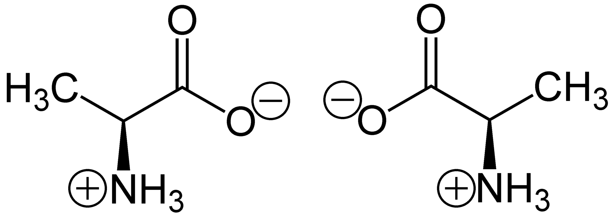

# The Expressive Power of Geometric GNNs for Enantiomer Differentiation

by Chaoran Cheng

Nov 28, 2023

## Introduction

In this repo, I explore the expressive power of current geometric GNNs for enantiomer differentiation. An **enantiomer** one of two stereoisomers that are non-superposable onto their own mirror image. In other words, enantiomers are chiral molecules that are mirror images of each other.

<br>
Alanine, a chiral molecule. Left: L-alanine or (*S*)-alanine, right: D-alanine or (*R*)-alanine. 

## Dataset

I followed this [paper](https://www.sciencedirect.com/science/article/pii/S2352340920303772) to construct an enantiomer conformation dataset for alanine. The original L-alanine trajectory were mirrored to simulate the enantiomer (D-alanine) behavior and water molecules were removed. A 90%/10% train/test split was assigned for both L-alanine and D-alanine, leading to a dataset of 18000 training samples and 2000 testing samples. See `data_process.py` for more details. The processed data is also provided under the `data` folder.

## Runing the Code

All codes are run with Python 3.9.15 and CUDA 11.6. The required packages are listed in `requirements.txt`.

To train a model, run the following command:
```bash
python configs/pointgcn.yml --savename pointgcn 
```
Different config files are provided under the `configs` folder. Most hyperparameters are self-explanatory. Feel free to modify them to suit your needs.

## Result

Below is the test accuracy for different GNN models. All model experiments were repeated 5 times (with the random seed set to null).

| Model | PointeNet |  SchNet  | DimeNet | DimeNet++ | TFN, SE(3) | TFN, E(3) |
| :---: | :---: |:--------:| :---: | :---: | :---: | :---: |
| Accuracy (%)| 50.0±0.0 | 50.0±0.0 | 50.0±0.0 | 50.0±0.0 | 50.0±0.0 | 100.0±0.0 |